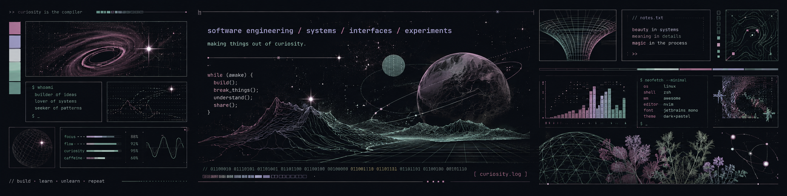

<div align="center">

# ✦ oi, eu sou a Gio ✦

### Engenharia de Software ✦ systems ✦ interfaces  ✦ experiments

`code` ✦ `create` ✦ `learn` ✦ 

</div>
## about this place
<table>
<tr>
<td width="52%">
<pre>
          .       *        .
     *         .                         .       *
              *                    .
                    .-""""""-.
                 .-'          '-.
               .'                '.
              /                    \
             ;          .           ;
             |                      |
             ;                      ;
              \                    /
           _.-'`-              .-'`-._
      _.-'        `-.________.-'        '-.
  /                                            \
 ;                                              ;
  \                                            /
   '-._                                    _.-'
       `--..__________________________..--'
                

        *                                  .
                     .            *  .
</pre>
  <div align="center">
<div align="center">
  
</div>

<sub>an idea, recursively becoming something else</sub>
</div>
</td>

<td width="48%">
<pre>
[ PERSONAL LAB / SIGNAL 01 ]

systems        active
interfaces     active
experiments    ongoing

status:
following whatever is interesting
</pre>
</td>
</tr>
</table>

I study Software Engineering and use this space as a cabinet for things I build, break, redesign, overthink and eventually understand.

Some projects are serious.  
Some started because I got curious .  
Most are probably somewhere in between.

<sub>
making things because I like seeing ideas become real.
</sub>
## currently orbiting

`backend systems` · `databases` · `data` · `machine learning` · `interfaces`

```text
python
postgresql
apis
react
data
automation
things that seemed like a good idea
